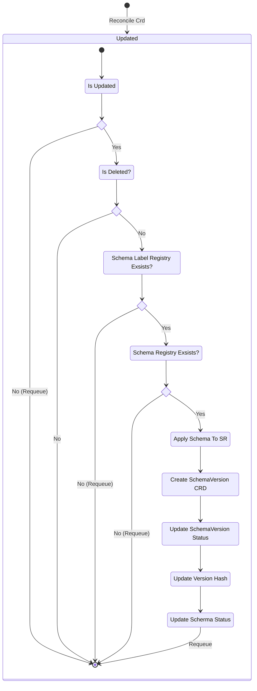

## Schema Reconciliation Loop

```mermaid
stateDiagram-v2
    [*] -->  Updated: Reconcile Crd

    state Updated {
        is_deleted: Is Deleted?
        state if_is_deleted <<choice>>

        is_updated: Is Updated
        state if_is_updated <<choice>>

        sr_exist: Schema Registry Exsists?
        state if_sr_exist <<choice>>

        sr_label_exsist: Schema Label Registry Exsists?
        state if_sr_label_exist <<choice>>

        apply_schema: Apply Schema To SR
        create_schema_version: Create SchemaVersion CRD
        update_schema_version_status: Update SchemaVersion Status
        update_version_hash: Update Version Hash
        update_schema_status: Update Scherma Status


        [*] --> is_updated

        is_updated --> if_is_updated
        if_is_updated --> is_deleted: Yes
        if_is_updated --> [*]: No (Requeue)

        is_deleted --> if_is_deleted
        if_is_deleted --> sr_label_exsist: No
        if_is_deleted --> [*]: No

        sr_label_exsist --> if_sr_label_exist
        if_sr_label_exist --> sr_exist: Yes
        if_sr_label_exist --> [*]: No (Requeue)

        sr_exist --> if_sr_exist
        if_sr_exist --> [*]: No (Requeue)
        if_sr_exist --> apply_schema: Yes

        apply_schema --> create_schema_version
        create_schema_version --> update_schema_version_status
        update_schema_version_status --> update_version_hash
        update_version_hash --> update_schema_status
        update_schema_status --> [*]: Requeue
    }
```
